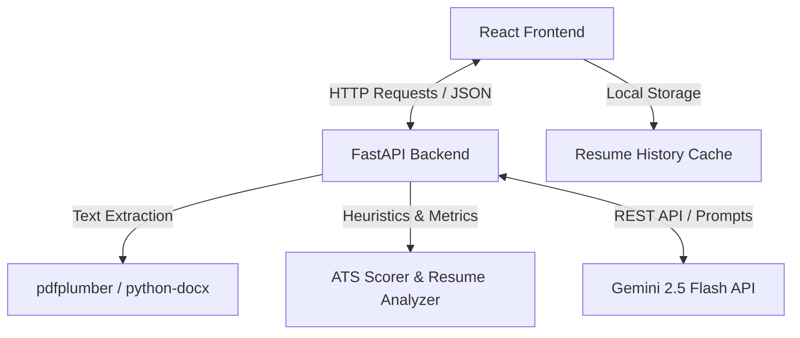

# ResumeIntellect 🧠💼

> **Production-Grade AI-Powered Resume Parser, ATS Scorer, and Career Optimization Suite.**

ResumeIntellect is a high-fidelity application designed to parse layout structures, extract hidden metadata, evaluate resume compliance against applicant tracking system (ATS) algorithms, and deliver interactive, AI-driven career optimization tools. Powered by Google's **Gemini 2.5 Flash** and a robust **FastAPI + React** stack, it provides job seekers with real-time feedback to optimize their professional profiles.

---

## 🚀 Key Features

*   **Intelligent Resume Parsing**: Extracted text deconstruction from PDF and Word (`.docx`) files using structural layout indexing and heuristic algorithms.
*   **ATS Score Analysis**: Computes a detailed, weighted ATS score based on formatting density, section completeness, contact syntax, skill keyword match rates, and career progression impact.
*   **Job Description (JD) Alignment**: Calculates keyword semantic compatibility against target job listings, highlights missing skills, and suggests resume bullet points to bridge the gap.
*   **AI Resume Assistant**: Interactive, drawer-based chat interface allowing candidates to converse directly with their resume context to get optimization suggestions.
*   **Cover Letter Generator**: Drafts tailored cover letters based on candidate metadata and job postings, adjustable across *professional*, *bold*, and *technical* tones.
*   **Interview Preparation Generator**: Curates custom mock interview questions (Technical, Project-based, Behavioral, and HR) with corresponding answer strategies.
*   **Shareable Reports**: Serializes analysis results into a compact Base64 URL payload, enabling read-only sharing without server-side database dependencies.
*   **Modern UI with Dark & Light Themes**: Sleek dashboard containing responsive visualizations (ATS breakdowns, domain coverage radar charts) and a clean, responsive layout.

---

## 🛠️ Tech Stack

### Frontend
*   **React 19 & TypeScript**: Component layer and strict type safety.
*   **Vite**: Fast, module-based bundler and dev server.
*   **Tailwind CSS**: Modern, utility-first UI styling.
*   **Recharts**: SVG-based responsive data visualizations (radar charts, bar charts, and pie charts).
*   **Framer Motion**: Smooth interface transitions and micro-animations.
*   **Lucide React**: Premium vector icons.

### Backend
*   **FastAPI**: High-performance, asynchronous web server framework.
*   **Python**: Core programming language.
*   **Google Gemini 2.5 Flash API**: Powers deep contextual analysis, document generation, and chat assistants.
*   **pdfplumber & python-docx**: Direct text and table extractors for PDF and Word documents.
*   **Pydantic**: Structural validation and request schemas.

---

## 📐 Architecture Overview

ResumeIntellect follows a decoupled client-server architecture:



1.  **Parsing Pipeline**: Documents are verified at the gateway (under 10MB, valid extensions) and written to memory/temporary paths. Text and tables are extracted, processed to strip noise, and passed to regex-based heuristic extractors.
2.  **Analysis and Score Calculation**: The backend runs structure and metadata scans, calculating whitelisted keyword weights and measuring professional highlights. An overall ATS score is computed using weighted category parameters.
3.  **LLM Enhancement**: Prompt payloads enclosing structural candidate context are sent asynchronously to Gemini 2.5 Flash for chat responses, letter generation, and mock question tailoring.

---

## ⚙️ Installation & Setup

### Prerequisites
*   **Node.js** (v18+ recommended)
*   **Python** (v3.9+ recommended)
*   **Google Gemini API Key** (Get one from [Google AI Studio](https://aistudio.google.com/))

### 1. Backend Setup
1.  Navigate to the backend directory:
    ```bash
    cd backend
    ```
2.  Create a virtual environment:
    ```bash
    python -m venv venv
    source venv/bin/activate  # On Windows use: venv\Scripts\activate
    ```
3.  Install dependencies:
    ```bash
    pip install -r requirements.txt
    ```
4.  Configure environment variables (see below).

### 2. Frontend Setup
1.  Navigate to the frontend directory:
    ```bash
    cd ../frontend
    ```
2.  Install packages:
    ```bash
    npm install
    ```

---

## 🔑 Environment Variables

Create a `.env` file in the **root** folder (or inside the `backend` folder) with the following content:

```env
# Google Gemini API Access Credentials
GEMINI_API_KEY=your_gemini_api_key_here
```

An `.env.example` file is included in both the root and backend directories for reference.

---

## 🏃 Running the Application

For a fully functional setup, run both the backend and frontend services simultaneously:

### Starting the FastAPI Backend
From the `backend` directory:
```bash
uvicorn main:app --reload --host 127.0.0.1 --port 8000
```
*The backend API will run locally at: `http://localhost:8000`*

### Starting the React Frontend
From the `frontend` directory:
```bash
npm run dev
```
*The frontend application will run locally at: `http://localhost:5173`*

---

## 📸 Screenshots

| Feature View | Screenshot Placeholder | Description |
| :--- | :--- | :--- |
| **Landing Page** | *`[Placeholder: Landing Page]`* | Drag-and-drop file upload interface with statistics. |
| **Main Dashboard** | *`[Placeholder: Dashboard Overview]`* | Interactive ATS Gauge, strengths, gaps, and roadmap visualizations. |
| **Domain Coverage** | *`[Placeholder: Skill Distribution Radar]`* | Radar chart illustrating parsed competency across categories. |
| **Job Description Matching** | *`[Placeholder: Job Match Panel]`* | Keyword alignment dial, matching proportion pie chart, and suggestions. |
| **AI Cover Letter Writer** | *`[Placeholder: Cover Letter Generator]`* | Form selecting letter tone presets and live export previewer. |
| **AI Mock Interview Prep** | *`[Placeholder: Mock Prep Drawer]`* | Tailwind card lists containing customized questions and revealable answers. |
| **AI Assistant Chat** | *`[Placeholder: Interactive Assistant Chat]`* | Drawer panel simulating interactive optimization conversation. |

---

## 🗺️ Future Roadmap

*   [ ] **OCR PDF Support**: Integrate fallback OCR engines (e.g., Tesseract or Gemini vision models) to parse scanned/image-only PDF resumes.
*   [ ] **JSON Schema Parsing**: Transition extraction heuristics to full-text structural LLM parsing to increase accuracy on creative layouts.
*   [ ] **Stateful Rate Limiting**: Migrate in-memory IP mapping to a Redis database to scale instance clusters.
*   [ ] **Multiple Export Formats**: Enable downloading optimized resumes in standardized DOCX and PDF layouts.

---

## 📄 License

Distributed under the **MIT License**. See `LICENSE` for more information.
