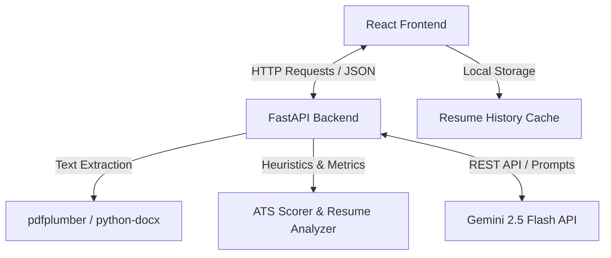

# ResumeIntellect 🧠💼


> AI-powered resume analyzer with ATS scoring, job matching, cover letter generation, interview preparation, and intelligent career assistance.

ResumeIntellect is an AI-powered career optimization platform that helps candidates improve their resumes using ATS scoring, job description matching, AI-generated cover letters, and personalized interview preparation.

Built with **FastAPI**, **React**, and **Gemini 2.5 Flash**, it provides real-time insights to help users stand out in the hiring process.

---

# ✨ Features

| Feature | Status |
|----------|---------|
| Resume Parsing | ✅ |
| ATS Score Analysis | ✅ |
| Job Description Match | ✅ |
| AI Resume Assistant | ✅ |
| Cover Letter Generator | ✅ |
| Interview Question Generator | ✅ |
| Shareable Reports | ✅ |
| Dark & Light Themes | ✅ |

---

# 🚀 Key Features

### 📄 Intelligent Resume Parsing
Extracts and processes text from PDF and DOCX resumes using structural layout analysis and heuristic algorithms.

### 📊 ATS Score Analysis
Calculates a weighted ATS score based on formatting, section completeness, keywords, and overall resume quality.

### 🎯 Job Description Matching
Compares resumes against target job descriptions, identifies missing keywords, and suggests improvements.

### 🤖 AI Resume Assistant
Interactive AI chat assistant that provides resume optimization suggestions using Gemini 2.5 Flash.

### ✉️ Cover Letter Generator
Generates tailored cover letters in different tones such as Professional, Technical, and Bold.

### 🎤 Interview Preparation Generator
Creates personalized technical, behavioral, project-based, and HR interview questions.

### 🔗 Shareable Reports
Allows users to share analysis results using compact URL-based report serialization.

### 🌙 Modern UI
Responsive dashboard with elegant dark and light themes, charts, and interactive visualizations.

---

# 🛠 Tech Stack

## Frontend

- React 19
- TypeScript
- Vite
- Tailwind CSS
- Framer Motion
- Recharts
- Lucide React

## Backend

- FastAPI
- Python
- Gemini 2.5 Flash API
- pdfplumber
- python-docx
- Pydantic

---

# 📐 Architecture

ResumeIntellect follows a decoupled client-server architecture.



### Workflow

1. Resume documents are uploaded and validated.
2. Text is extracted using PDF and DOCX parsers.
3. ATS scores and metrics are calculated.
4. Gemini enhances results through AI-powered analysis.
5. Interactive reports and recommendations are displayed.

---

# 📂 Project Structure

```text
AI-Resume-Analyzer
│
├── backend
│   ├── main.py
│   ├── gemini_service.py
│   ├── requirements.txt
│   └── ...
│
├── frontend
│   ├── src
│   ├── public
│   ├── package.json
│   └── ...
│
├── README.md
├── .env.example
└── .gitignore
```

---

# 📡 Backend API

### Health Check

```http
GET /health
```

### Upload & Analysis

```http
POST /upload
POST /analyze
POST /ats-score
POST /jd-match
```

### AI Services

```http
POST /generate-cover-letter
POST /generate-interview-questions
POST /chat
```

---

# ⚙️ Installation

## Prerequisites

- Node.js (18+)
- Python (3.9+)
- Google Gemini API Key

---

## Backend Setup

```bash
cd backend

python -m venv venv

source venv/bin/activate
# Windows
venv\Scripts\activate

pip install -r requirements.txt
```

---

## Frontend Setup

```bash
cd frontend

npm install
```

---

# 🔑 Environment Variables

Create a `.env` file:

```env
GEMINI_API_KEY=your_gemini_api_key_here
```

Example configuration files are included in:

- `.env.example`
- `backend/.env.example`

---

# ▶️ Running the Application

## Start Backend

```bash
cd backend

uvicorn main:app --reload --host 127.0.0.1 --port 8000
```

Backend:

```
http://localhost:8000
```

---

## Start Frontend

```bash
cd frontend

npm run dev
```

Frontend:

```
http://localhost:5173
```

---

# 🌐 Live Demo

### Frontend

Coming Soon 🚀

### Backend

Coming Soon 🚀

---

# 📸 Screenshots

| Feature | Preview |
|-----------|---------|
| Landing Page | *(Coming Soon)* |
| Dashboard | *(Coming Soon)* |
| ATS Analysis | *(Coming Soon)* |
| Job Match | *(Coming Soon)* |
| Cover Letter Generator | *(Coming Soon)* |
| Interview Preparation | *(Coming Soon)* |
| AI Assistant Chat | *(Coming Soon)* |

---

# 🗺 Future Roadmap

- [ ] OCR support for scanned PDFs
- [ ] Resume templates
- [ ] DOCX/PDF export
- [ ] Authentication system
- [ ] Redis-based rate limiting
- [ ] Database support
- [ ] Streaming AI responses
- [ ] Multi-language support

---

# 🤝 Contributing

Contributions, issues, and feature requests are welcome.

Feel free to fork this repository and submit pull requests.

---

# 📄 License

Distributed under the MIT License.

See the `LICENSE` file for more information.

---

# ⭐ Support

If you found this project useful, consider giving it a star ⭐ on GitHub.

It helps others discover the project and motivates further development.
